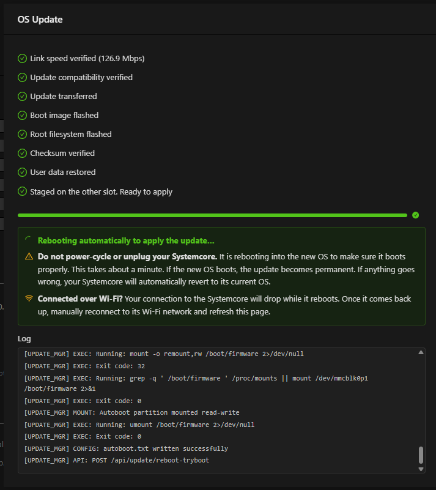

# Imaging your Systemcore

No specialized imaging software is required. The process runs through the
Systemcore's own web interface at ``robot.local``.

## Prerequisites

- A ``.llupdate`` file downloaded from the
  `Systemcore releases page <https://github.com/LimelightVision/systemcore-os-public/releases/latest>`_.
  Make sure to download the alpha or beta update that matches your Systemcore unit.
- A Wi-Fi or USB connection to the Systemcore

.. note:: Units running an OS version older than alpha/beta 11 must use the
   Limelight Hardware Client instead of the web interface described here.

## Imaging Procedure

1. Download the ``.llupdate`` file for the current season from the
   `Systemcore releases page <https://github.com/LimelightVision/systemcore-os-public/releases/latest>`_.

   .. image:: images/imaging-your-systemcore/llupdate.png
      :alt: The Systemcore release page with the .llupdate file download link boxed in yellow.

2. Connect to the Systemcore over Wi-Fi or USB.
3. Open a browser and navigate to ``robot.local``.
4. Click the settings (gear) icon and open the configure/update section.

   .. image:: images/imaging-your-systemcore/configuretab.png
      :alt: The Systemcore home page with a box around the settings wheel tab that leads to the configure and update tab.

5. Under **OS Update**, click **Select File**, choose the ``.llupdate``
   file you downloaded, then click **Flash Update**. The process takes
   several minutes to complete.

   .. image:: images/imaging-your-systemcore/findos.png
      :alt: The Systemcore configuration page at the OS Update section.

Once the update finishes, every step shows a check mark:

.. note::

   **USB connection:** a success message appears once the update finishes.

   **Wi-Fi connection:** the Systemcore reboots as part of the update.
   Manually reconnect and refresh the page to see the completion status.
